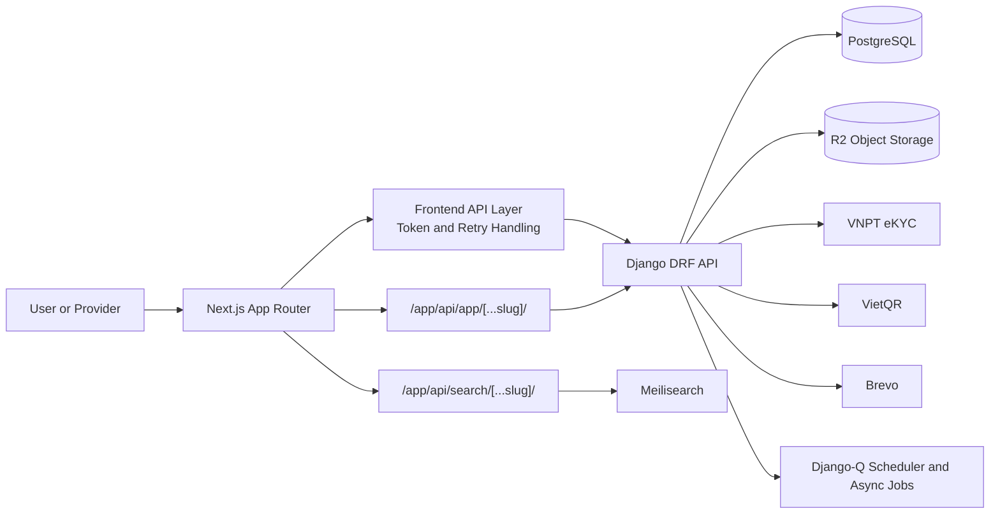
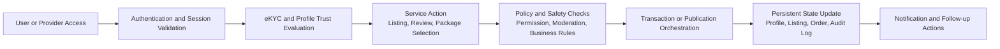
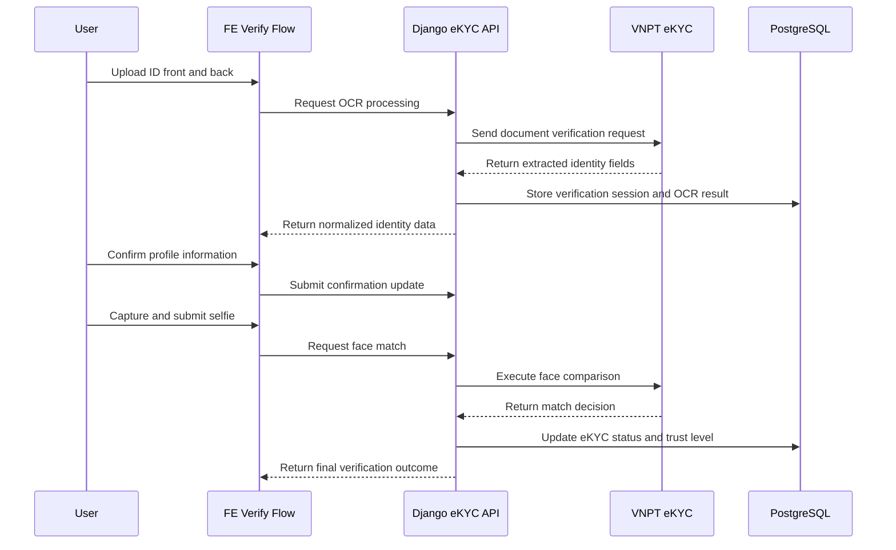
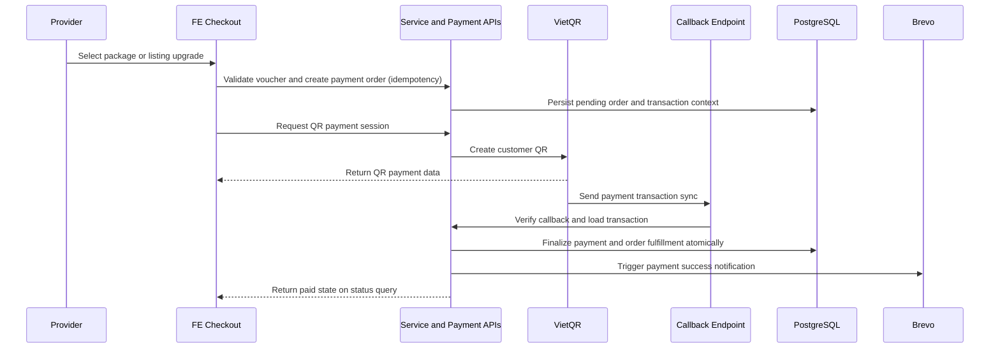
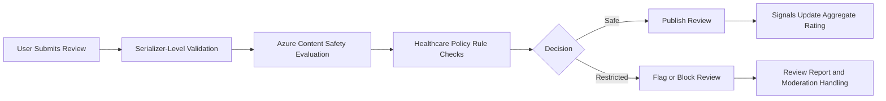
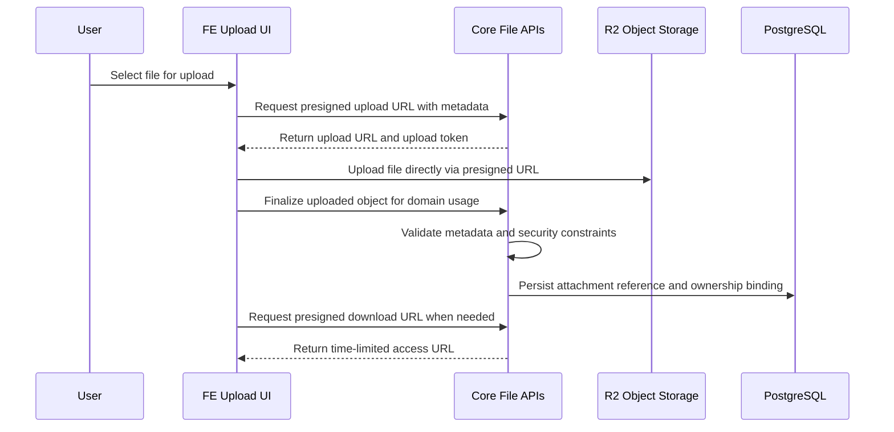
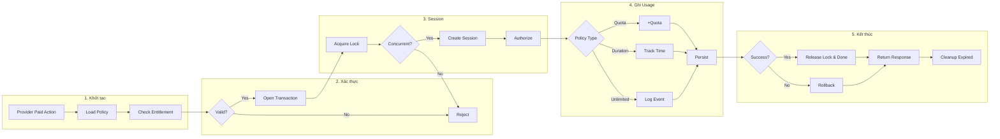

# KhambenhVN: Digital Health System Wiki

## Executive Summary

KhambenhVN is a healthcare-focused digital platform that combines identity trust, content safety, and service monetization in one ecosystem. It enables verified users and healthcare providers to build trusted profiles, publish healthcare-related listings, engage with moderated community content, and complete secure QR-based payments through a streamlined user journey.

## Overview

KhambenhVN is a digital healthcare platform built to connect patients, healthcare professionals, clinics, and medical product providers in one trusted ecosystem.

It supports:

* Digital identity verification (eKYC) for safer onboarding
* Professional and facility profile management
* Healthcare-focused marketplace listings
* AI-assisted content safety for reviews and user-generated content
* Flexible authentication with phone login, OTP verification, and social login (including Zalo)
* Secure digital payments with QR-based checkout
* Automated notification emails for payment and lifecycle events

The platform is designed to provide a safe, scalable, and high-trust foundation for digital healthcare services in Vietnam.

## 1. Technical Scope and Capability Map

KhambenhVN combines trust, healthcare content safety, profile-driven discovery, and service monetization into one runtime platform.

### Platform Capability Groups

* **Trust and Access:** OTP-based account verification, social login federation, and multi-step eKYC.
* **Provider Identity and Presence:** Doctor/facility profiles and listing publication lifecycle.
* **Community and Quality Signals:** Reviews, ratings, reporting, and moderation policy enforcement.
* **Commercial Operations:** Package upgrades, voucher validation, VietQR checkout, and entitlement fulfillment.
* **Lifecycle Communication:** In-app notifications and transactional/lifecycle email dispatch.
* **Secure Data and Media Handling:** Presigned object flows, validation, and controlled retrieval patterns.

## 2. Implementation-Verified Architecture (Backend + Frontend)

This architecture section reflects current implementation behavior in the codebase.

### 2.1 Technology Stack by Platform Layer

| Platform Layer | Primary Role in System | Technology Set |
| --- | --- | --- |
| Experience Layer | Delivers user-facing journeys for onboarding, profile management, posting, and checkout. | Next.js (React + TypeScript) |
| Access and Identity Layer | Handles account validation, OTP lifecycle, and social provider federation. | OTP verification, Zalo, Google, Facebook login |
| Trust Intelligence Layer | Performs identity verification and moderation checks in critical trust flows. | VNPT eKYC API, Azure Content Safety |
| Application Orchestration Layer | Executes business state transitions across listing, service, voucher, and payment domains. | Python / Django + DRF |
| Data and Discovery Layer | Persists transactions and supports retrieval/search across domains. | PostgreSQL, Meilisearch |
| Commercial Integration Layer | Coordinates payment session creation and callback-driven finalization. | VietQR |
| Communication Layer | Sends payment and lifecycle communications. | Brevo |
| Storage Layer | Stores and serves media via object workflows. | Cloudflare R2 (S3-compatible) |
| Infrastructure Layer | Provides runtime, networking, and deployment foundation. | AWS |

### 2.2 Runtime Topology

### 2.3 End-to-End Platform Flow

### 2.4 Runtime Architecture by Layer

1. **API Layer (Django + DRF):** Domain APIs are exposed through router-based and explicit endpoints.
2. **Domain Layer:** Modules are separated by feature domains with clear boundaries and API-service-task composition patterns.
3. **Orchestration Layer:** Service modules coordinate order lifecycle, entitlement, publication state, and payment finalization.
4. **Persistence and Search Layer:** PostgreSQL is the transactional source; Meilisearch is used for retrieval acceleration.
5. **Integration Layer:** VNPT eKYC, VietQR, and Brevo are integrated through controlled call flows.
6. **Operational Layer:** Scheduler jobs, async tasks, and cache invalidation support lifecycle automation.

## 3. Backend Domain Modules and Technical Responsibilities
| Module | Core Feature Scope | Architecture and Techniques Applied |
| --- | --- | --- |
| `core` | Shared platform services: file upload/download flows, notifications API surface, common helpers and middleware. | Cross-cutting middleware, presigned object access pattern, security validation utilities, cache-aware helpers. |
| `authx` | Account lifecycle, OTP verification, registration/login, password reset, social auth coordination. | DRF endpoint orchestration, token/session flow, OTP state transitions, provider federation adapters. |
| `authx.zalo` | Zalo-specific social authentication and account linking path. | Provider-specific adapter flow and callback normalization into common auth domain behavior. |
| `doctor` | Professional profile domain for doctors and related public/profile-facing information. | Domain models + API views, profile lifecycle control, relationship mapping to reviews/listings. |
| `facility` | Medical facility profile domain and facility-facing listing identity context. | Structured facility entities, API endpoint segregation, link points for marketplace/service visibility. |
| `blog` | Editorial/knowledge content publishing and article-style healthcare communication. | CMS-style content entities, CRUD publishing flow, reusable content rendering patterns. |
| `market` | Marketplace and community post lifecycle (draft, submit, publish, close, reopen, expire). | Stateful model methods, controlled status transitions, publication window handling, indexing hooks. |
| `location` | Geographic normalization and location data used across doctor/facility/listing/search journeys. | Shared lookup domain, relational mapping for filtering and discoverability. |
| `review` | Reviews, ratings, reports, and moderation decisions for user-generated trust signals. | Serializer-level policy checks, AI-assisted moderation integration, signals for automation and rating updates. |
| `content` | Shared content taxonomies and reusable content-related entities used by multiple domains. | Reusable domain abstraction to prevent duplicated content definitions across modules. |
| `faq` | Structured question-answer knowledge domain for support and guidance content. | Lightweight knowledge model with admin-driven lifecycle and read-optimized exposure. |
| `payment` | Transaction lifecycle for QR creation, payment status query/cancel, callback synchronization. | Callback-safe finalization, transactional integrity, idempotent transaction handling, external gateway adapter. |
| `service` | Commercial package/order orchestration, entitlement logic, renewal and lifecycle jobs. | Service-layer orchestration, row-level locking, `transaction.atomic`, scheduler jobs, idempotency keys. |
| `voucher` | Voucher issuance rules, validation, usage tracking, and checkout eligibility control. | Pre-payment validation gate, controlled redemption records, race-safe usage accounting. |
| `ekyc` | Identity verification with OCR, field confirmation, selfie/face match, and session continuation. | Multi-step verification session model, external eKYC integration, trust-level status progression. |
| `privacy_preferences` | User privacy and communication preference controls. | Preference-state persistence with policy-aligned retrieval/update boundaries. |
| `notification` | Email delivery integration and notification event handling. | Event-driven notification dispatch, template-based outbound email service integration. |

## 4. Frontend Architecture and Delivery Pattern

1. **Route Architecture:** Next.js App Router organizes user journeys by domain (profile, posting, checkout, search, verification).
2. **Data Strategy:** React Query manages server state, while Zustand handles user/session and feature-local state.
3. **API Strategy:** Frontend calls backend APIs directly and uses internal proxy routes for app and search forwarding.
4. **Session Reliability:** Token refresh and retry-safe request sequencing are centralized in API infrastructure.
5. **Feature Composition:** eKYC, listing, payment, voucher, and notification journeys are split into dedicated APIs, hooks, states, and page-level components.

## 5. Feature Implementation Matrix (Backend + Frontend + Techniques)

| Feature | Backend Implementation | Frontend Implementation | Applied Techniques |
| --- | --- | --- | --- |
| Authentication, OTP, Social Login | `authx` handles register/login/verify/resend/reset OTP and social-login/social-signup endpoints, plus provider configuration in settings. | Auth APIs are wrapped in `FE/apis/user.ts`; login/register/social flows are consumed by popup/page-level forms and session store updates. | OTP lifecycle state machine, provider federation, retry-safe token refresh and guarded request replay. |
| eKYC (OCR, Confirm, Face Match) | `ekyc` exposes upload-and-ocr, confirm-and-update, face-match, session read/reset endpoints with verification-session persistence. | Verification UI (`VerifyID`) drives multi-step upload-confirm-selfie flow through `FE/apis/verify.ts` with explicit step gating. | Multi-step trust workflow, external OCR/face-match integration, verification state progression and recovery. |
| Content Moderation and Review Safety | Review serializer pipeline applies Azure safety checks and business rules; review reports and signal-driven rating updates are managed in review domain. | Community/review APIs submit content and moderation-related actions from posting/review interfaces. | AI-assisted moderation, business-policy layering, post-publish automation through signals. |
| Marketplace Listing Lifecycle | `market` model/viewset lifecycle includes draft, submit, publish, reopen, close, expire; publication metadata is persisted for lifecycle automation. | Market/community posting APIs and route groups manage create/edit/publish/reopen flows and listing state presentation. | Explicit domain state transitions, publication windows, search index lifecycle hooks. |
| Service Orders and Commercial Packages | `service` orchestrates package/upgrade orders and fulfillment through service-layer modules and order state handling. | Unified payment-order APIs and checkout states coordinate package/upgrade journeys before QR payment handoff. | Order orchestration, idempotency, transactional service-state transitions, fulfillment consistency controls. |
| Entitlement Management and Validation | Entitlement services validate purchase rights, reserve/release entitlement sessions, and enforce concurrency-safe usage with scheduled cleanup jobs. | Entitlement and renewal states are tracked in dedicated frontend stores and checkout-related flows to gate paid feature access. | Row-level locking, `transaction.atomic`, entitlement session TTL cleanup, race-safe access checks. |
| Voucher Validation and Usage | Voucher endpoints validate applicability, track voucher usage records, and bind redemption to order/payment context. | Voucher API integration is embedded in checkout to validate code eligibility before payment request creation. | Pre-payment eligibility gate, controlled redemption accounting, duplicate-usage prevention. |
| VietQR Payment and Callback Finalization | Payment APIs create/query/cancel QR transactions; callback sync endpoint validates and finalizes transaction + order state atomically. | QR payment screens render transaction data and poll status until callback-driven finalization is reflected. | Webhook-style callback handling, idempotent finalization, payment state machine integrity. |
| Notification and Email Lifecycle | Core notification endpoints and Brevo mail service dispatch payment/lifecycle events after critical transitions. | Notification APIs and query hooks render list/read status and keep user-facing lifecycle status visible. | Event-driven communication, asynchronous dispatch integration, lifecycle-triggered templates. |
| Media Upload and Access Control | Core presign upload/finalize/download endpoints enforce validation/sanitization and controlled object accessibility boundaries. | Upload flows request presigned URLs, upload directly to object storage, then finalize for attach/use in domain entities. | Presigned object access, MIME and size validation, secure finalize-before-use pipeline. |
| Search and Discovery | Meilisearch client and model indexing contracts maintain searchable entities and de-index on lifecycle transitions. | Search proxy route and search APIs back search pages with query-driven retrieval across supported domains. | Search offload to dedicated index, index lifecycle synchronization, domain-aware discovery. |

## 6. Critical Feature Flows (Detailed)

### 6.1 eKYC Verification Flow

### 6.2 Checkout, VietQR, and Fulfillment

### 6.3 Publication Lifecycle, Scheduler, and Expiry

### 6.4 Content Moderation and Review Safety Flow

### 6.5 Secure File Upload and Access Control Flow

### 6.6 Entitlement Validation and Lifecycle Flow

## 7. Operational Engineering Techniques Applied in Production Code

1. **Scheduler Jobs (Django-Q):** Automated jobs run for pending-order expiry, entitlement session release, and publication expiry checks.
2. **Asynchronous Task Offloading:** Selected non-blocking tasks (for example, cache invalidation and some notification/report paths) run asynchronously.
3. **Idempotency Control:** Payment/order flows use idempotency keys to prevent duplicate commercial actions during retries.
4. **Transactional Consistency:** Critical financial and entitlement transitions are protected with `transaction.atomic` and row-level locking patterns.
5. **Callback-Safe Payment Finalization:** VietQR synchronization endpoint validates callback intent before final state transition.
6. **Caching Strategy:** Public config, entitlement catalog, and integration tokens are cached to reduce repeated latency and load.
7. **Secure File Delivery Pattern:** Upload/download access uses presigned flows plus validation/sanitization before file finalization.

## 8. Business Value

* Increase trust through digital identity verification.
* Improve service quality through safer user-generated content.
* Simplify monetization with integrated payment and package flows.
* Scale digital operations with a modular, API-driven architecture.
