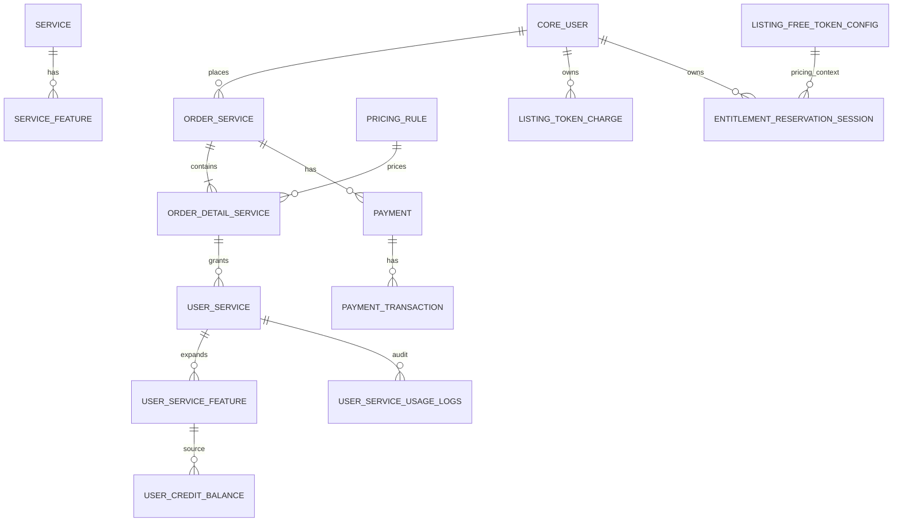
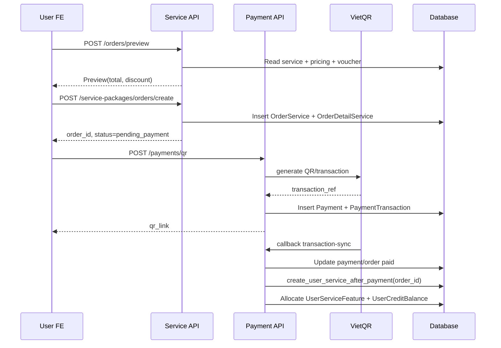
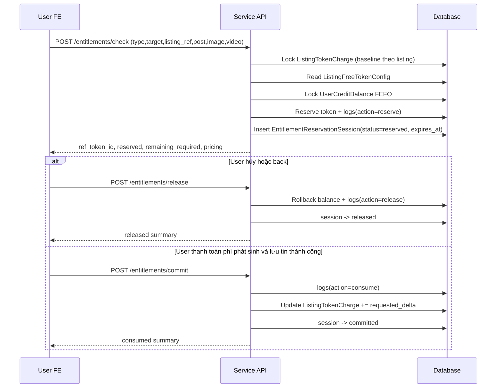

# SPEC HỆ THỐNG SUBSCRIPTION

## 1) Mục tiêu

Tài liệu này là mô tả kỹ thuật chính cho hệ thống Subscription/Entitlement/Payment hiện tại:

* Chuẩn hóa flow mua gói và cấp quyền lợi.
* Chuẩn hóa flow check-reserve-release-commit token cho listing.
* Đảm bảo không double charge, không over-reserve, có audit đầy đủ.
* Chốt quy tắc `quantity_remaining = NULL` là unlimited (không dùng `is_unlimited`).

---

## 2) Nguyên tắc domain

### 2.1 Single source of truth

* Số dư token của user: `UserCreditBalance`.
* Baseline token đã charge theo listing: `ListingTokenCharge`.
* Log/session chỉ dùng để audit và điều khiển state, không dùng để suy diễn lại baseline.

### 2.2 Unlimited

* Unlimited được biểu diễn bằng `quantity_remaining IS NULL`.
* Service feature unlimited được biểu diễn bằng `ServiceFeature.quantity IS NULL`.

### 2.3 Tính token theo delta

Công thức bắt buộc:

`requested_delta = max(requested_now - charged_baseline, 0)`

Ý nghĩa:

* Chỉ tính token cho phần tăng mới.
* Không charge lại phần đã trả ở các lần cập nhật trước.
* Không refund tự động khi user giảm số lượng.

---

## 3) Mô hình dữ liệu

### 3.1 Bảng chính

* `service_service`: định nghĩa sản phẩm/gói.
* `service_servicefeature`: quyền lợi theo feature (`post`, `image`, `video`, `posting_service`).
* `service_pricingrule`: bảng giá server-side.
* `service_orderservice`, `service_orderdetailservice`: đơn hàng và item.
* `service_userservice`, `service_userservicefeature`: quyền lợi đã cấp cho user.
* `service_usercreditbalance`: số dư token tiêu thụ theo FEFO.
* `service_userserviceusagelogs`: reserve/release/consume audit log.
* `service_listingfreetokenconfig`: free quota dùng chung theo `target_type`.
* `service_listingtokencharge`: baseline đã charge theo listing.
* `service_entitlementreservationsession`: session reserve theo `ref_token_id`, có TTL.
* `payment_payment`, `payment_paymenttransaction`: payment gateway integration.

### 3.2 ER Diagram



---

## 4) State machine

### 4.1 Session state

| Từ        | Sang      | Hợp lệ |
| --------- | --------- | ------ |
| reserved  | committed | YES    |
| reserved  | released  | YES    |
| committed | released  | NO     |
| released  | committed | NO     |

### 4.2 TTL

* `EntitlementReservationSession.expires_at` bắt buộc có giá trị khi reserve.
* TTL mặc định: 10 phút.
* Session `reserved` hết TTL sẽ được release bởi job định kỳ.

Command:

`python manage.py release_expired_entitlement_sessions --limit 500`

---

## 5) API contract chính

Base: `api/v1/service/`

### 5.1 Order

* `POST /orders/preview`
* `POST /service-packages/orders/create`
* `POST /orders/{id}/retry`
* `POST /orders/{id}/cancel`
* `GET /orders`, `GET /orders/{id}`

### 5.2 Entitlement

* `POST /entitlements/check`
* `POST /entitlements/release`
* `POST /entitlements/commit`
* `GET /entitlements`
* `GET /credits`

### 5.3 Payment

* `POST /api/v1/payments/qr`
* `POST /vqr/bank/api/transaction-sync`

---

## 6) Flow 1 - User mua gói dịch vụ

### 6.1 Sequence diagram



### 6.2 Ghi dữ liệu chính

* Đơn hàng: `OrderService`, `OrderDetailService`.
* Thanh toán: `Payment`, `PaymentTransaction`.
* Quyền lợi sau paid:

  * `UserService`
  * `UserServiceFeature`
  * `UserCreditBalance`
  * `UserServiceUsageLogs(action=allocate)`

### 6.3 Quy tắc unlimited khi cấp quyền lợi

* Nếu `ServiceFeature.quantity IS NULL`:

  * `UserServiceFeature.quantity_remaining = NULL`
  * `UserCreditBalance.quantity_remaining = NULL`

---

## 7) Flow 2 - Đăng tin mới (check-reserve-payment-commit)

### 7.1 Sequence diagram



### 7.2 Công thức tính token

1. `requested`: token listing cần hiện tại (post/image/video).
2. `charged_baseline`: đọc từ `ListingTokenCharge`.
3. `requested_delta = max(requested - charged_baseline, 0)`.
4. `free_applied = min(requested_delta, free_quota)`.
5. `required_after_free = requested_delta - free_applied`.
6. Reserve theo FEFO trên `UserCreditBalance`.
7. `remaining_required` → tính phí phát sinh bằng `PricingRule`.

---

## 8) Flow 3 - Cập nhật tin đăng (thêm/xóa ảnh-video)

### 8.1 Mục tiêu

* Không charge lại phần token đã thanh toán trước.
* Chỉ charge phần tăng mới vượt baseline.

### 8.2 Ví dụ image

* Baseline hiện tại: `charged_image = 5`.
* User update listing lên 7 image.
* `requested_delta = max(7 - 5, 0) = 2`.
* Hệ thống chỉ reserve/charge cho 2 image tăng thêm.
* Sau commit: `charged_image = 7`.

### 8.3 Ví dụ giảm rồi tăng lại

* Baseline `charged_image = 7`.
* Giảm xuống 4: `requested_delta = 0`.
* Tăng lên 6: `requested_delta = 0`.
* Tăng lên 9: `requested_delta = 2` (chỉ charge thêm 2).

### 8.4 Video và posting_service

* Video áp dụng y hệt image qua `charged_video`.
* `posting_service` đã có cột `charged_posting_service` để mở rộng cùng pattern.

---

## 9) Pricing

* Không hardcode giá trong service code.
* Tất cả lấy từ `PricingRule`.
* Mapping chính hiện tại:

  * post → `POSTING_FEE_30_DAYS_{TARGET}`
  * image → `EXTRA_IMAGE`
  * video → `EXTRA_VIDEO`

---

## 10) Concurrency, transaction, idempotency

### 10.1 Concurrency control

* Lock bắt buộc:

  * `EntitlementReservationSession`
  * `UserCreditBalance`
  * `ListingTokenCharge`

### 10.2 Transaction boundary

* Mỗi flow nằm trong 1 transaction:

  * check + reserve
  * release
  * commit

### 10.3 Idempotency

* `ref_token_id` là unique key cho phiên.
* Retry check với cùng context/requested:

  * không reserve lại,
  * trả lại payload session đã có.
* Retry release/commit:

  * follow state machine, trả kết quả idempotent.

---

## 11) Audit và truy vết

### 11.1 Tracking key

* Tất cả flow reserve/release/consume đều gắn `ref_token_id` trong:

  * `EntitlementReservationSession.ref_token_id`
  * `UserServiceUsageLogs.idempotency_key`
  * `ListingTokenCharge.last_ref_token_id`

### 11.2 Truy vết một listing đã charge bao nhiêu

SQL:

```sql
SELECT
  user_id,
  target_type,
  listing_ref_type,
  listing_ref_id,
  charged_post,
  charged_image,
  charged_video,
  charged_posting_service,
  last_ref_token_id,
  updated_at
FROM service_listingtokencharge
WHERE user_id = :user_id
  AND listing_ref_type = :listing_ref_type
  AND listing_ref_id = :listing_ref_id;
```

---

## 12) Checklist QA

* Reserve không overdraw số dư credit.
* Retry check cùng `ref_token_id` không tạo session mới.
* Session hết TTL được release bởi command.
* Commit sau release bị chặn.
* Release sau commit bị chặn.
* Update listing không bị charge lại token đã trả.
* Pricing fallback đọc từ `PricingRule`.

---

## 13) File code liên quan

* Core logic: `src/service/services/entitlement_check.py`
* Cấp quyền lợi sau paid: `src/service/services/userservice.py`
* Models: `src/service/models.py`
* APIs: `src/service/views.py`, `src/service/serializers.py`
* Admin ops: `src/service/admin.py`, `src/market/admin.py`
* TTL command: `src/service/management/commands/release_expired_entitlement_sessions.py`

---

## 14) Ghi chú vận hành

* Sau khi deploy code mới:
  1. Cấu hình scheduler chạy command release TTL (1–5 phút/lần).
