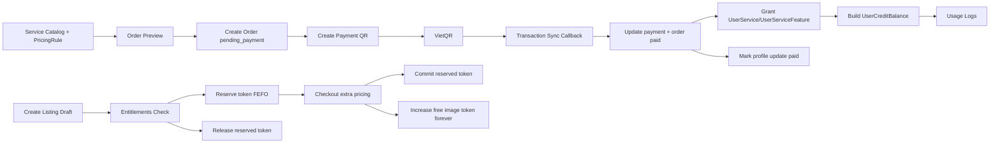
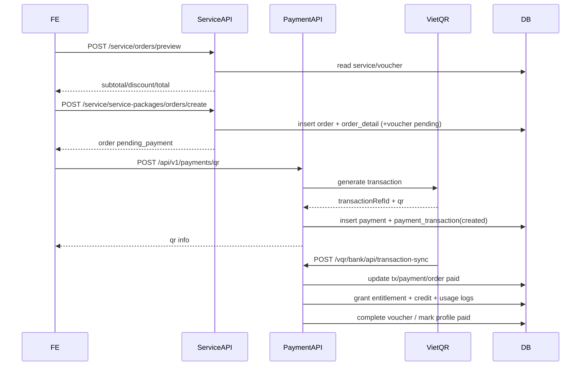
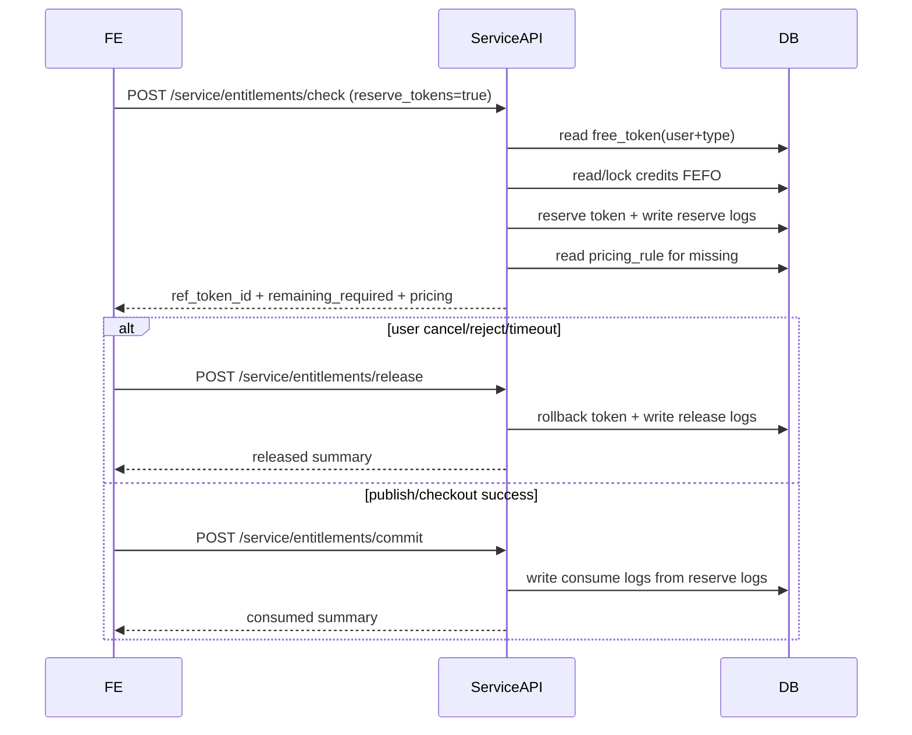
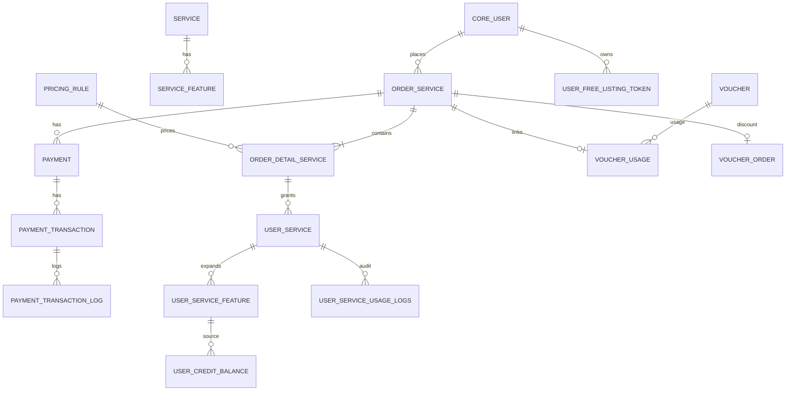

# Báo cáo Kỹ thuật Subscription/Payment (As-Implemented)

## 1) Mục tiêu nghiệp vụ

- Chuẩn hóa domain cho `catalog/pricing/order/payment/entitlement/credit`.
- Hỗ trợ đầy đủ mua gói, mua thêm, retry/cancel, voucher, profile paid-flow.
- Triển khai flow check entitlement theo phiên đăng tin:
  - reserve token
  - rollback token
  - commit token
  - tính phí phát sinh từ pricing rule.
- Bổ sung free-token trọn đời theo `user + loại tin` và quy tắc tăng vĩnh viễn `image_token` khi mua extra image.
- Xây dựng admin console để vận hành nghiệp vụ:
  - tạo order nâng cấp cho user
  - approve tin với checkout phí phát sinh thay user.

Phạm vi: **Backend (BE)**.

---

## 2) Kiến trúc tổng thể hiện tại

### 2.1 Các lớp nghiệp vụ

- **Catalog/Pricing layer**: `Service`, `ServiceFeature`, `PricingRule`.
- **Order layer**: `OrderService`, `OrderDetailService`, idempotent create, retry/cancel.
- **Payment layer**: `Payment`, `PaymentTransaction`, webhook idempotent.
- **Entitlement layer**: `UserService`, `UserServiceFeature`, `UserCreditBalance`.
- **Ledger layer**: `UserServiceUsageLogs` với action `allocate/reserve/release/consume/...`.
- **Free-token layer**: `UserFreeListingToken` theo `user + target_type`.
- **Admin operation layer**:
  - `Subscription Console` trong service admin
  - `Approve Listing Checkout` trong market admin.

---

## 3) Sequence các luồng chính

## 3.1 Mua gói chuẩn + thanh toán

## 3.2 Check entitlement cho phiên đăng tin (reserve/release/commit)

---

## 4) ER diagram cập nhật

---

## 5) Thay đổi schema và ý nghĩa

## 5.1 Service domain

### `Service`
- Có `code`, `target_type`, `billing_unit`, `entitlement_mode`, `purchase_policy`, `is_stackable`.
- Mục đích: mô tả sản phẩm/gói theo target và policy.

### `PricingRule`
- `scope`, `target_type`, `cycle`, `amount`, `currency`, `metadata`, `starts_at/ends_at`.
- Mục đích: source-of-truth cho giá, không hardcode phía FE.

### `ServiceFeature`
- Có `is_unlimited` (thay cho `image_lifetime` cũ), `reset_policy`, `expires_with_entitlement`.
- Mục đích: mô hình quyền lợi linh hoạt + biểu diễn unlimited chuẩn.

### `OrderService`, `OrderDetailService`
- Trạng thái chuẩn: `draft/pending_payment/paid/failed/canceled/expired`.
- `scope_type` + `target_type` + `target_id` để trace tới account/profile/listing.

### `UserService`, `UserServiceFeature`, `UserCreditBalance`, `UserServiceUsageLogs`
- Cấu trúc entitlement + credit pool + ledger đầy đủ.
- `UserServiceUsageLogs.action` hỗ trợ `allocate/reserve/release/consume/...`.

### `UserFreeListingToken` (mới)
- Bảng lưu free token trọn đời theo `user + target_type`.
- Field: `post_token`, `image_token`, `video_token`, `posting_service_token`.
- Unique constraint: `(user, target_type)`.

### Bootstrap free token cho user mới
- Signal ở `src.service.signals`: khi tạo user, auto khởi tạo:
  - `target_type=CHO_DUOC_PHAM`
  - `post=1`, `image=3`, `video=0`, `posting_service=0`.

## 5.2 Payment domain

### `Payment`
- Thêm `provider`, `idempotency_key`, `external_ref`, `metadata`.
- Sẵn sàng đa cổng + đối soát + chống lặp.

### `PaymentTransaction`
- Có `idempotency_key`, `metadata`, `raw_data`.
- Callback xử lý idempotent và tránh duplicate trạng thái paid.

## 5.3 Voucher domain

### `Voucher`
- `code` cho phép blank và tự sinh.
- Hỗ trợ manual/auto code.

### `VoucherUsage`, `VoucherOrder`
- Theo dõi pending/completed/canceled usage và discount applied theo order.

## 5.4 Profile paid-flow

- `DoctorProfileUpdateRequest` và `MedicalFacilityProfileUpdateRequest` có `is_paid`, `payment_status`.
- Sau callback paid, service `mark_profile_updates_paid` cập nhật trạng thái.

---

## 6) API contract hiện tại

Base: `api/v1/service/`

### Catalog/Pricing
- `GET /catalog`
- `GET /service-packages/`
- `GET /service-packages/{id}`

### Order
- `POST /orders/preview`
- `POST /service-packages/orders/create`
- `GET /service-packages/orders/pending`
- `GET /orders`
- `GET /orders/{id}`
- `POST /orders/{id}/retry`
- `POST /orders/{id}/cancel`

### Entitlement/Credit/History
- `GET /entitlements`
- `GET /credits`
- `POST /entitlements/check`
- `POST /entitlements/release`
- `POST /entitlements/commit`
- `GET /transactions/history`
- `GET /payments/history`
- `GET /profile-payables`

### Payment gateway
- `POST /api/v1/payments/qr`
- `POST /vqr/bank/api/transaction-sync`

---

## 7) Flow `entitlements/check` (đã triển khai)

## 7.1 Mục tiêu
- Check khả năng đăng tin theo token.
- Trả thiếu (`remaining_required`) + pricing fallback.
- Hỗ trợ reserve token cho một phiên đăng tin và rollback/commit theo `ref_token_id`.

## 7.2 Thuật toán
1. Xác định group theo `type/target`.
2. Đọc free token trọn đời (`UserFreeListingToken`) theo `user + pricing_target_type`.
3. Tính:
   - `required_after_free = max(requested - free_token, 0)`
4. Lấy credits còn hạn, sort FEFO (`expires_at ASC`).
5. Reserve token theo thứ tự FEFO.
6. Tính:
   - `remaining_required = max(required_after_free - reserved, 0)`
7. Map pricing:
   - `post -> POSTING_FEE_30_DAYS_{TARGET}`
   - `image -> EXTRA_IMAGE`
   - `video -> EXTRA_VIDEO`

## 7.3 Cơ chế rollback/commit
- `POST /entitlements/release`: hoàn token đã reserve + ghi `action=release`.
- `POST /entitlements/commit`: chốt tiêu hao qua `action=consume` (không trừ thêm quantity).

---

## 8) Quy tắc free image tăng vĩnh viễn

- Khi checkout extra có `feature_type=image` và thanh toán thành công:
  - Tăng `UserFreeListingToken.image_token` theo `target_type`.

Đã áp dụng tại:
- flow **admin approve checkout** (`src/market/admin.py`)
- callback payment (`src/payment/view/transaction_sync_view.py`) khi order metadata có `pricing + target_type`.

---

## 9) Cập nhật zone Admin

## 9.1 Service admin
- `Subscription Console` trong `OrderServiceAdmin`:
  - tạo order theo user/scope
  - auto tạo QR
  - auto mark paid + cấp quyền lợi
  - xem nhanh order/user_service/credit.
- Admin mới cho `UserFreeListingToken` để vận hành free quota.

## 9.2 Market admin
- Mỗi tin đăng có flow `Approve Listing Checkout`:
  1. Check entitlement + reserve token
  2. Hiển thị pricing thiếu như FE
  3. Admin checkout thay user
  4. Commit token
  5. Approve publish
- Có nút release reservation nếu hủy duyệt.

---

## 10) Mapping model -> table

- `Service` -> `service_service`
- `ServiceFeature` -> `service_servicefeature`
- `PricingRule` -> `service_pricingrule`
- `OrderService` -> `service_orderservice`
- `OrderDetailService` -> `service_orderdetailservice`
- `UserService` -> `service_userservice`
- `UserServiceFeature` -> `service_userservicefeature`
- `UserCreditBalance` -> `service_usercreditbalance`
- `UserFreeListingToken` -> `service_userfreelistingtoken`
- `UserServiceUsageLogs` -> `service_userserviceusagelogs`
- `Payment` -> `payment_payment`
- `PaymentTransaction` -> `payment_paymenttransaction`
- `PaymentTransactionLog` -> `payment_paymenttransactionlog`
- `Voucher` -> `voucher_voucher`
- `VoucherUsage` -> `voucher_voucherusage`
- `VoucherOrder` -> `voucher_voucherorder`

---

## 11) Tóm tắt đáp ứng yêu cầu mới

- [x] API `POST /api/v1/service/entitlements/check`
- [x] FEFO reserve token + pricing fallback
- [x] `ref_token_id` để rollback/commit theo phiên
- [x] Table free token trọn đời theo `user + type`
- [x] Mặc định user mới có free token (`CHO_DUOC_PHAM: post=1,image=3`)
- [x] Extra image làm tăng free image vĩnh viễn
- [x] Admin flow approve tin có checkout phát sinh thay user
- [x] Report/diagram/flow đồng bộ trạng thái triển khai hiện tại
